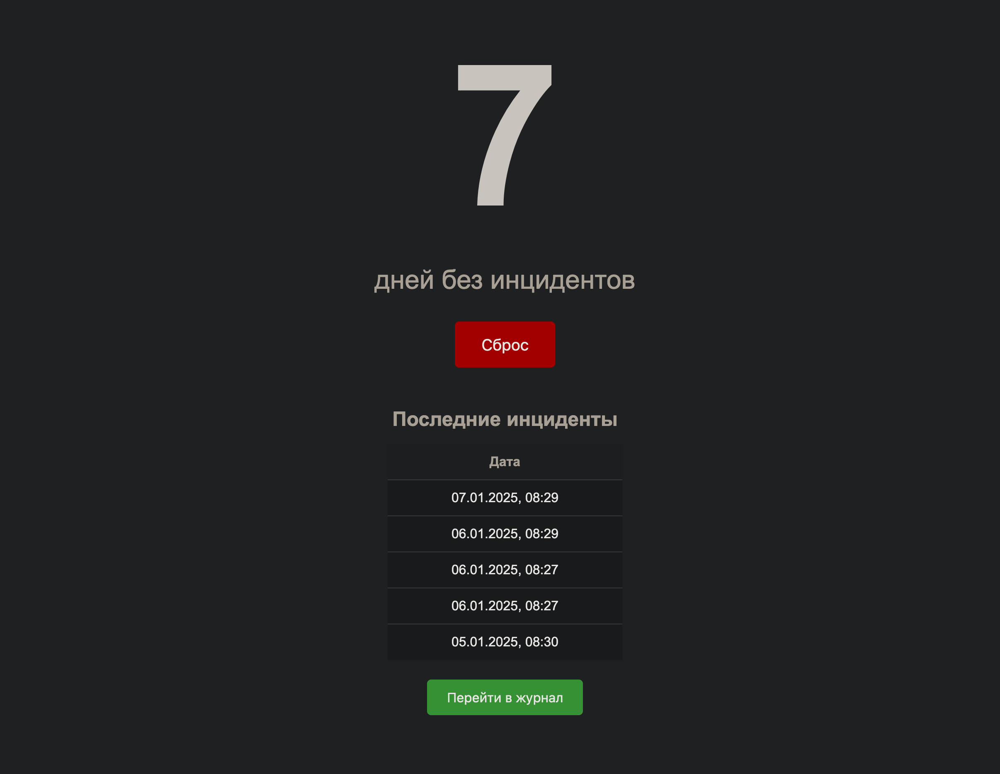

# Счетчик дней без инцидентов

Веб-приложение для отслеживания количества дней, прошедших с последнего инцидента. Приложение позволяет вести учет инцидентов и быстро переходить к журналу в wiki.



## Функциональность

- Отображение количества дней с последнего инцидента
- Автоматическое склонение слова "день" в зависимости от числа
- Кнопка сброса счетчика при возникновении нового инцидента
- Таблица последних 5 инцидентов с датами
- Быстрый переход к журналу инцидентов в wiki
- Сохранение всех данных между перезапусками

## Требования

- Docker
- Docker Compose

## Установка и запуск

1. Клонируйте репозиторий:

```bash
git clone <repository-url>
cd <repository-name>
```

2. Создайте файл `.env` из примера:

```bash
cp .env.example .env
```

3. При необходимости отредактируйте `.env` файл, изменив URL для перехода в журнал:

```
VITE_GOOGLE_URL=https://your-wiki-url.com
```

4. Запустите приложение через Docker Compose:

```bash
docker-compose up -d
```

Приложение будет доступно по адресу: http://localhost

## Использование

- **Просмотр счетчика**: Большая цифра в центре экрана показывает количество дней с последнего инцидента
- **Сброс счетчика**: При возникновении инцидента нажмите кнопку "Сброс". Это обновит дату последнего инцидента и откроет страницу журнала в новой вкладке
- **История инцидентов**: В таблице под счетчиком отображаются даты последних 5 инцидентов
- **Переход в журнал**: Используйте зеленую кнопку "Перейти в журнал" для быстрого доступа к полному журналу инцидентов

## Разработка

Для локальной разработки:

1. Создайте файл `.env`:

```bash
cp .env.example .env
```

2. Установите зависимости:

```bash
npm install
```

3. Запустите бэкенд:

```bash
npm run serve
```

4. В отдельном терминале запустите фронтенд:

```bash
npm run dev
```

## Структура проекта

- `src/` - Исходный код фронтенда (Vue.js)
- `server/` - Код бэкенда (Node.js/Express)
- `server/date.json` - Файл для хранения данных
- `Dockerfile.frontend` - Dockerfile для фронтенда
- `Dockerfile.backend` - Dockerfile для бэкенда
- `docker-compose.yml` - Конфигурация Docker Compose
- `nginx.conf` - Конфигурация Nginx
- `.env.example` - Пример конфигурационного файла
- `.env` - Конфигурационный файл (создается из .env.example)

## Данные

Все данные хранятся в файле `server/date.json`. Файл автоматически создается при первом запуске и сохраняется между перезапусками контейнера благодаря Docker volume.

### Автор

Yegorov Vassiliy

- <https://egorovanet.ru>
- <https://realmanual.ru>
